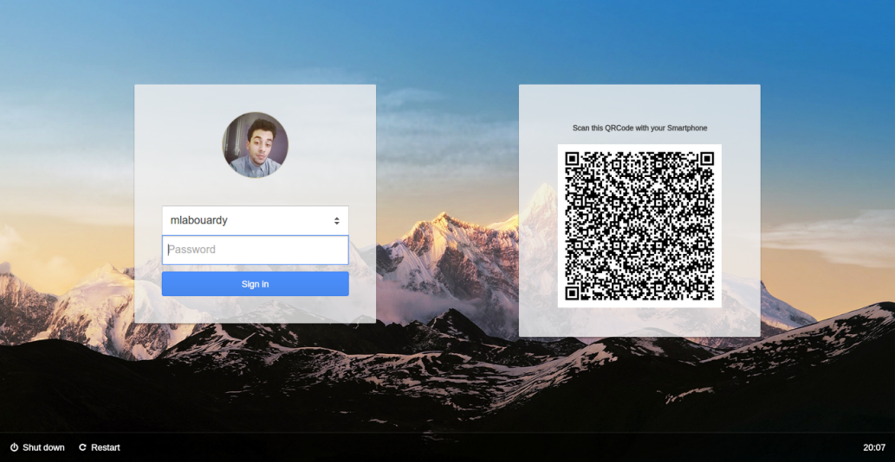
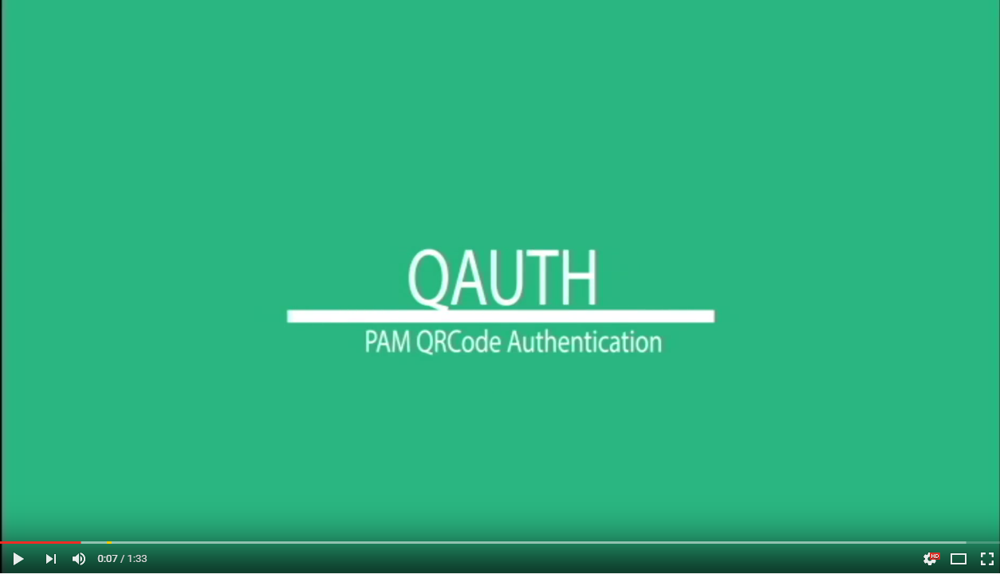

## PAM QRCode Module

PAM QRCode Authentication is a pluggable authentication module designed for authentication.using QRCode based on Challenge Response

## Quickstart 

## How it works ?

This technique is easy to use, requiring users to only take a picture of the QR code with a camera on their cell phones. The computer displays a QR code that embeds a challenge. The cell phone generate the response to the challenge, and send the response via the Webcam of the computer.

## System Requirements

- LightDM
- OpenCV
- ZBar
- OpenSSL
- QRenCode
- Lightdm-webkit-greeter

## Help

If you run into issues, please don't hesitate to find help on the GitHub project.

## License

The PAM QRCode project is covered by the MIT License.

The MIT License (MIT)

Copyright (c) 2016 Mohamed Labouardy and contributors to the PAM QRCode project.

Permission is hereby granted, free of charge, to any person obtaining a copy of this software and associated documentation files (the "Software"), to deal in the Software without restriction, including without limitation the rights to use, copy, modify, merge, publish, distribute, sublicense, and/or sell copies of the Software, and to permit persons to whom the Software is furnished to do so, subject to the following conditions:

The above copyright notice and this permission notice shall be included in all copies or substantial portions of the Software.

THE SOFTWARE IS PROVIDED "AS IS", WITHOUT WARRANTY OF ANY KIND, EXPRESS OR IMPLIED, INCLUDING BUT NOT LIMITED TO THE WARRANTIES OF MERCHANTABILITY, FITNESS FOR A PARTICULAR PURPOSE AND NONINFRINGEMENT. IN NO EVENT SHALL THE AUTHORS OR COPYRIGHT HOLDERS BE LIABLE FOR ANY CLAIM, DAMAGES OR OTHER LIABILITY, WHETHER IN AN ACTION OF CONTRACT, TORT OR OTHERWISE, ARISING FROM, OUT OF OR IN CONNECTION WITH THE SOFTWARE OR THE USE OR OTHER DEALINGS IN THE SOFTWARE.
